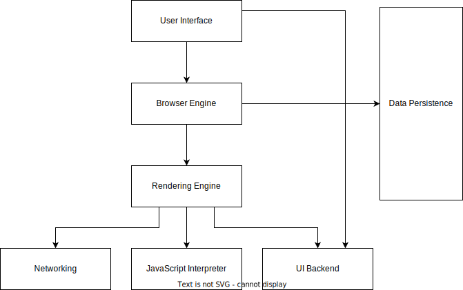

## Week 1 - Exercise 1.1

### When a user enters an URL in the browser, how does the browser fetch the desired result ?

When we type a url like "https://www.example.com" in the browser:

1. The browser parses the information contained in the URL like the protocol, the domain name, and the resource
1. The browser communicates with the ISP to do a DNS lookup to get the IP address for the web server
1. After a successful lookup, the browser receives the IP address of the target website
1. The browser opens a TCP connection to the IP address of the web server
1. The browser receives the response from the server and parses it and displays the result
1. If the response is of type HTML, then the browser parses through its contents and fetches all the linked assets like images, CSS files, and JavaScript files

### a. What is the main functionality of the browser?

The main functionality of a browser is to retrieve and display web pages from the World Wide Web.
It fetches information from servers and renders the information in the appropriate way according to the response type.
The information is usually in the form of an HTML document, but may also be a PDF, image, or some other type of content.

### b. High level components of a browser

1. **UI (User Interface):** All the visual elements that we see of the browser. This consists of elements like the address bar, refresh page and bookmark buttons, the response section, and the developer tools.
1. **Browser Engine:** The internal engine of the browser recevies input from the browser's user interface and returns the computed results (from the rendering engine) to the user interface to update it appropriately.
1. **Rendering Engine:** It is responsible for displaying requested content. Eg. if the requested content is HTML, the rendering engine parses HTML and CSS, and displays the parsed content on the screen.
1. **Networking:** This components consists of all the logic to parse addresses of different resources and fetch them using the specified protocol.
1. **UI backend:** This is used for drawing basic widgets like combo boxes and windows. This backend exposes a generic interface that is not platform specific. Underneath it uses operating system user interface methods.
1. **JavaScript Interpreter:** This component is responsible for executing all the JavaScript entered by a user and for updating the DOM to update the display.
1. **Data Storage:** This includes all the storage mechanisms present in a browser like session storage, cookies, local storage, and IndexedDB.

 

 

### c. Rendering engine and its use

Once a request is made, the requested document is received in chunks of 8KB from the networking layer and the following steps of the rendering engine take place:

1. Parse the requested HTML doc in chunks, including the external CSS files and in style elements. Convert the HTML elements into DOM nodes to form a “content tree” or "DOM tree."
1. Simultaneously, the browser creates a render tree. This tree includes both the styling information as well as the visual instructions that define the order in which the elements will be displayed. The render tree ensures that the content is displayed in the desired order.
1. The render tree goes through the layout process. When a render tree is created, the position or size values are not assigned. The entire process of calculating values for evaluating the desired position is called a layout process. In this process, every node is assigned the exact coordinates. This ensures that every node appears at an accurate position on the screen.
1. Finally, the screen is painted, wherein the render tree is traversed, and the renderer’s paint() method is invoked, which paints each node on the screen using the UI backend layer.

Hence, the use of the rendering engine is to parse and display the requested HTML document.

Additional notes:

Different browsers use different rendering engines: Internet Explorer uses Trident, Firefox uses Gecko, Safari uses WebKit. Chrome and Opera (from version 15) use Blink, a fork of WebKit.

WebKit is an open source rendering engine which started as an engine for the Linux platform and was modified by Apple to support Mac and Windows.

Some browsers such as Chrome run multiple instances of the rendering engine: one for each tab. Each tab runs in a separate process.

### d. Parsers (HTML, CSS, etc)

**HTML Parser:** The job of the HTML parser is to parse the HTML markup into a parse tree. The algorithm consists of two stages: tokenization and tree construction.

**CSS Parser:** CSS is a context free grammar. It can be parsed according to the following W3 specification: https://www.w3.org/TR/CSS2/grammar.html.

### e. Script Processors

As the document is being parsed, the parser halts when it encounters a script tag. It fetches the script if needed and then parses and it executes it immediately.

### f. Tree construction

While the DOM tree is being constructed, the browser constructs another tree, the render tree. This tree is of visual elements in the order in which they will be displayed. It is the visual representation of the document. The purpose of this tree is to enable painting the contents in their correct order.

The elements in the render tree can also be called as "frames" (Firefox) or "renderer" (WebKit) or "render object" (WebKit).

A renderer knows how to lay out and paint itself and its children.

Each renderer represents a rectangular area usually corresponding to a node's CSS box. It includes geometric information like width, height and position.

A few things to note: All elements execept the non-visual DOM elements are inserted in the render tree. There are DOM elements which correspond to several visual objects like the select element which has three renderers.

Building the render tree requires calculating the visual properties of each render object. This is done by calculating the style properties of each element. Browsers tackle the computation and apply styles from all origins in the right order.

### g. Order of script processing

In early days of the web, `script` tags were parsed and executed when the parser encountered them. If the script was external, it was fetched and the document parsng is halted until it the script was fetched.
Now, we can use the `defer` attribute to specify if we want the script to be executed after the document parsing and also the `async` attribute to specify if we want the script to be parsed and executed by a different thread.

Firefox and WebKit make use of the `Speculative parsing` optimization: While executing scripts, another thread parses the rest of the document and finds out what other resources need to be loaded from the network and loads them. In this way, resources can be loaded on parallel connections and overall speed is improved.

### h. Layout and Painting

When the renderer is created and added to the tree, it does not have a position and size. Calculating these values is called layout or reflow.

In the painting stage, the render tree is traversed and the renderer's "paint()" method is called to display content on the screen. Painting uses the UI infrastructure component.

#### References

https://web.dev/howbrowserswork
